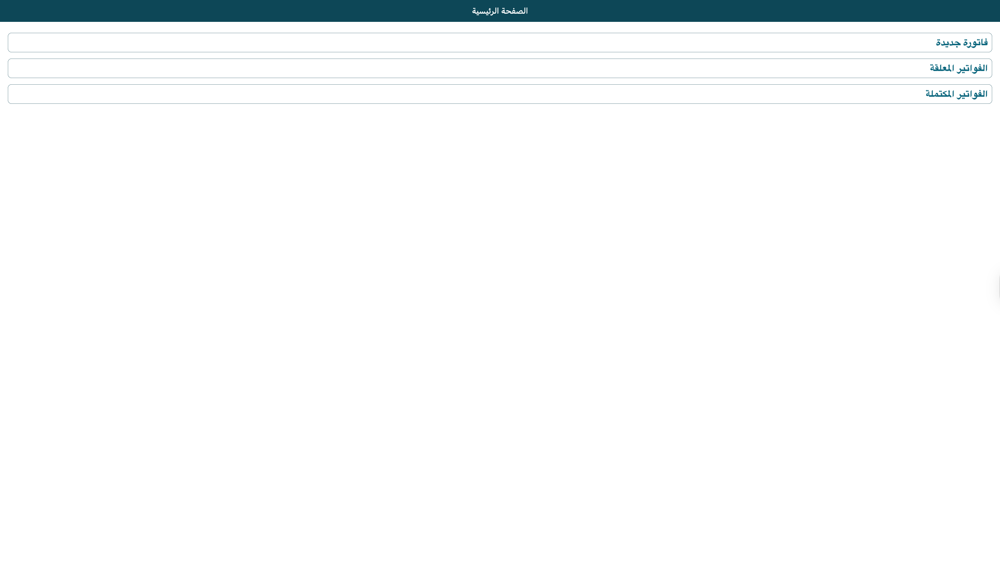
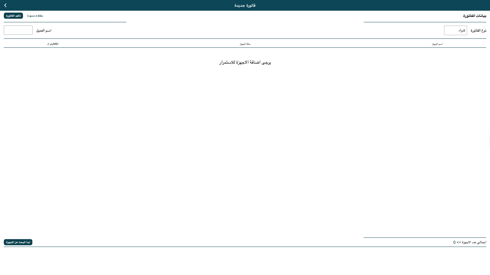

# Crystal Devices — IMEI Invoice Manager

A desktop tool that reads iPhone and iPad identity data over USB and syncs invoices to Firebase in real time, replacing manual IMEI entry across multiple store branches.


---

## The Problem

I work with a phone trading business that has two branches — one in Dubai and one in Al Ain. I handle the books from Al Ain, while the Dubai branch receives shipments of iPhones and iPads. Every time a batch arrived, someone in Dubai had to read each IMEI off the phone screen, send a WhatsApp screenshot to me, and I'd manually type each number into a spreadsheet. For a shipment of 50+ devices, that meant typos, missed digits, and hours of back-and-forth just to get the numbers right.

## The Solution

Plug an iPhone or iPad into the computer via USB, press "Start Search," and the app reads the IMEI, model name, storage capacity, and activation state automatically. Every scanned device appears in a live invoice that syncs to Firebase — so I see the data from Al Ain the moment it's scanned in Dubai, no screenshots or manual entry needed. Audio feedback confirms each scan, so the operator can work through a stack of devices without watching the screen.

## Screenshots

| Home | Invoice | Pending |
|------|---------|---------|
|  |  |  |

## Architecture

```
lib/
├── main.dart                   # App entry, Firebase init, root BlocProvider
├── cubit/                      # State management (Cubit + Freezed)
│   ├── invoice_cubit.dart      # Invoice business logic and device list operations
│   └── invoice_state.dart      # Immutable state definition
├── screens/                    # Full-page views
│   ├── home_page.dart          # Landing screen with customer input and navigation
│   ├── invoice_screen.dart     # Active invoice — device scanning and list display
│   └── pending_invoices_screen.dart  # View and resume draft invoices from Firestore
├── widgets/                    # Reusable UI components
│   ├── devices_search_button.dart    # Triggers USB device scan
│   ├── devices_list_view.dart        # Scrollable scanned-device list
│   ├── devices_list_title.dart       # Column headers for device list
│   ├── customer_name_text_field.dart  # Customer name input
│   ├── invoice_type_drop_down.dart   # Buy/sell selector
│   ├── submit_invoice_button.dart    # Save invoice to Firestore
│   ├── end_of_page.dart              # Invoice summary footer
│   └── default_divider.dart          # Styled divider
└── helpers/
    ├── api_result.dart         # Typed error handling (Success/Failure sealed class)
    ├── functions.dart          # ideviceinfo CLI integration, device parsing, file export
    ├── colors.dart             # App theme constants
    ├── context_extension.dart  # BuildContext size helpers
    └── string_extension.dart   # String-to-double parsing
```

## Tech Stack

- **Flutter** — cross-platform desktop UI (macOS and Windows)
- **Bloc / Cubit** — predictable, testable state management
- **Cloud Firestore** — real-time invoice sync between branches
- **ideviceinfo** (libimobiledevice) — reads iOS device identity data over USB
- **audioplayers** — audio feedback on scan events
- **Freezed** — immutable state classes with pattern matching

## Key Decisions

- **CLI over native plugin** — `ideviceinfo` from libimobiledevice is battle-tested and available on macOS, Windows, and Linux. Writing a custom native USB plugin would have taken weeks for the same result, with more edge cases to handle.
- **Firestore over REST API** — the Al Ain branch needs to see scanned devices appear the moment they're scanned in Dubai. Firestore's streaming snapshots handle this with zero polling and no custom server.
- **Audio feedback** — the operator scans devices one after another, hands on the phones, not the keyboard. A distinct sound for "new device" vs. "already scanned" lets them work without looking at the screen.
- **Invoice draft mode** — shipments arrive in batches throughout the day. Draft mode lets you pause and resume an invoice instead of forcing one session per shipment. This was added after watching someone lose 30 minutes of scanning by accidentally closing the app.
- **Local device name mapping** — iOS `ProductType` identifiers (e.g., `iPhone17,1`) are mapped to human-readable names via a local lookup table, avoiding an external API dependency for something that rarely changes.

## Getting Started

**Prerequisites:**
- Flutter SDK 3.9+
- A Firebase project with Firestore enabled
- `ideviceinfo` installed (`brew install libimobiledevice` on macOS)

```bash
git clone https://github.com/YaseinAbuqlawa/crystal-devices.git
cd crystal-devices
```

Generate your Firebase config using the [FlutterFire CLI](https://firebase.flutter.dev/docs/cli/) — this creates `lib/firebase_options.dart`:

```bash
flutterfire configure
flutter pub get
dart run build_runner build --delete-conflicting-outputs
flutter run -d macos    # or -d windows
```

## What I Learned

Building for a real workflow I dealt with daily — not a tutorial exercise — forced decisions I wouldn't have made otherwise. Draft mode wasn't in the original plan; it was added when I realized that shipments overlap — a second customer walks in while you're still scanning devices for the first. The operator needed to pause one invoice, start another, and come back to finish later. Audio feedback came from noticing that the operator's eyes are always on the phones, not the screen — a distinct sound for "new device" vs "already scanned" meant they could work without looking up. The best features came from being the end user, not from planning on a whiteboard.
